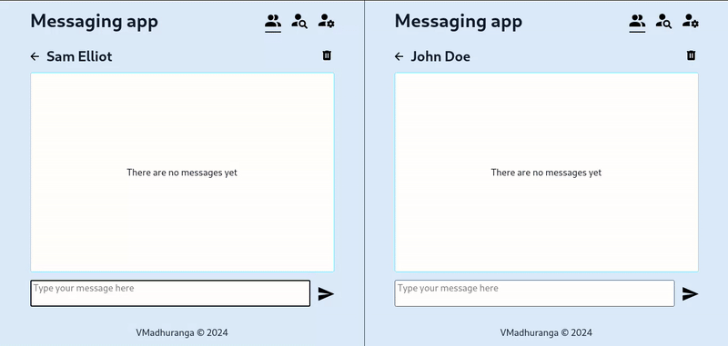

# Messaging App

Messaging App is a realtime chat application built using React, NodeJS, ExpressJS, MongoDB and SocketIO

## Demo

**Link**: https://messaging-app-dkf.pages.dev/

## Lessons Learned

By doing this project I've learned:

- How create testing database using [mongodb-memory-server](https://github.com/nodkz/mongodb-memory-server)
- How to test API using [supertest](https://github.com/ladjs/supertest)
- How to create bi-directional communication channel between a client and a server using [SocketIO](https://socket.io/)

## Repositories

- [Front-end](https://github.com/VMadhuranga/messaging-app-frontend)
- [Back-end](https://github.com/VMadhuranga/messaging-app-backend)

## Acknowledgements

This project is part of [The Odin Project](https://www.theodinproject.com/), a free online course to learn full-stack web development.

## Known Issues

- Messaging with a deleted user will result in an error response.
